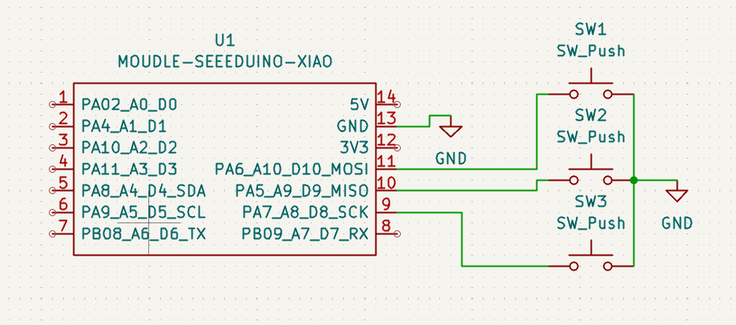
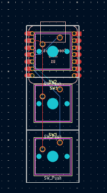

# Hackpad
A repository for the Hackpad You Ship We Ship event hosted by Hack Club.

__Case__
The case is supposed to go together as shown in the video below.

__Hackpad__
The finished product of this hackpad is shown below.

__PCB__
This is the PCB design. I followed the tutorial as this is my first ever PCB design. Of course if this Hackpad actually works, then I can apply it to a larger area of a 3 x 3 macropad, to learn how to use diodes to use less pins on the microcontroller. This would then be able to be applied to a real keyboard.

__Schematic__
This is the schematic design which also was from the Hackpad guide.

__Firmware__
This keyboard is powered by the QMK firmware. If you press long enough on the first key, it will then switch to the next mode. There are 3 modes, once it reaches the third, it then goes back to the first. The first mode is for all of my power settings. The second mode is for a media player. The third mode is miscellaneous items that I use on my computer with a disk drive.

__Bill of Materials (BOM)__:
1x Seeed Studio XIAO RP2040
3x Cherry MX Switches
1x Case (2 Printed Parts)
3x DSA Keycaps
Soldering Iron
